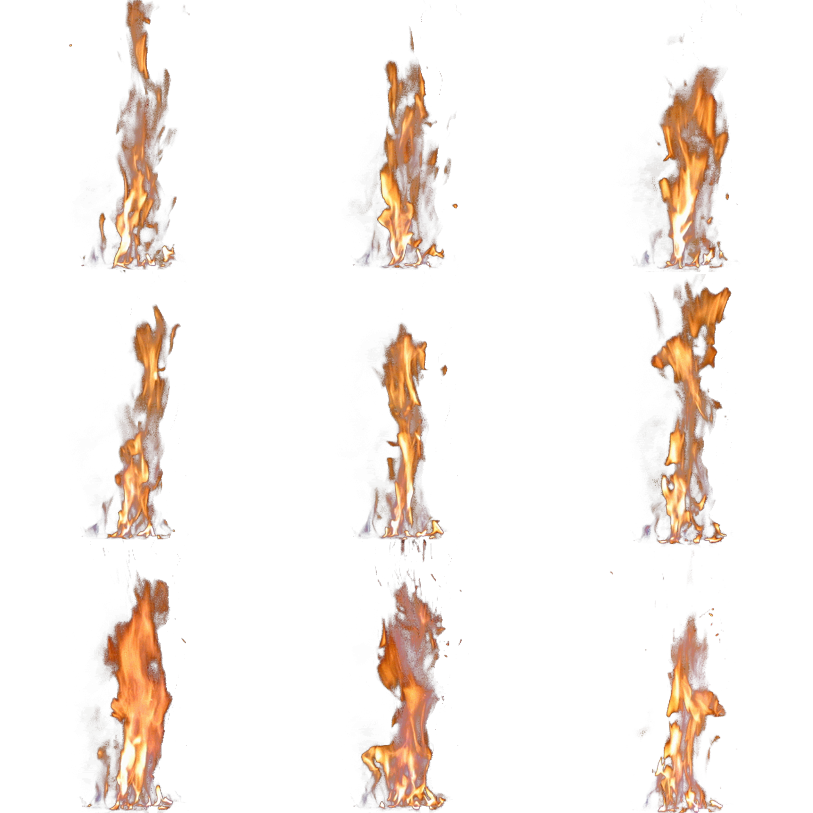

# Efficient Rendering of Real-Time Fire using OpenGL

Explanation and Demo of this repo:

https://www.youtube.com/watch?v=lJj4MQ-3ojg&ab_channel=CormacMadden

## Billboarding
The fire is rendered on a 2D plane that is set to always face the direction of the camera, this technique is referred to as billboarding and it is frequently used in older 3D games such as Quake.

It is also used to render more complex objects such as fire, clouds and particles.

To create the billboarding effect I simply changed the fire shader to only update the position and scale of the rendered mesh, but not the rotation.

## Texture Atlases
To animate the texture, a texture atlas is used. A texture atlas is an image that contains several images arranged in a grid, which can be individually rendered.
This is often done to save storage space and improve rendering speed, as it means only one draw call is used to render several different objects.
The frames of the fire animation are stored in the texture atlas and iterated over in a loop.

</img>

## Other Improvements

To improve the effect, several animated sprites were placed in front of each other to give the illusion of depth.
A flickering orange light was added to the scene to better integrate the fire in the environment.
The images were rendered using additive blending which makes the fire look quite bright and increases the brightness of the semi transparent parts of the image.

A Gui was created to manipulate various parts of the effect.
Two sliders were added for adjusting the scale of the fire on the X and Y axis.
A slider was added to adjust the speed at which the fire animation played.
Checkboxes were used to enable and disable the: Flickering light, Additive Blending and layered planes.